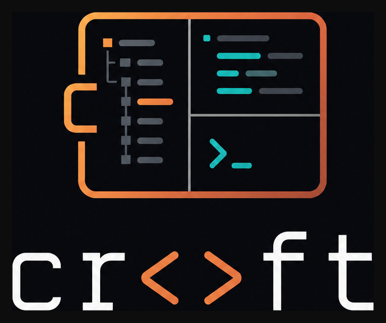

<div align="center">
  
</div>

# croft

A VS Code style three pane workspace that runs entirely inside your terminal. Written in Rust and shipped as a single static binary.

## Tenets

The non-negotiables behind every decision in croft:

1. **Speed is a must.** Every feature is weighed against its cost on the hot path before it lands.
2. **Low latency is non-negotiable.** Keystrokes and clicks register instantly; rendering is coalesced so a noisy shell can never starve input.
3. **Local and remote parity always binds.** Behaviour on your Mac and on a Linux box over SSH is identical. There is no second-class remote mode.
4. **The gap between terminal and GUI stays minimal.** croft should look and feel like VS Code, down to the icons and motion.
5. **Everything has a shortcut.** Every action is reachable from the keyboard, and no menu item ships without an accelerator.
6. **Correctness beats workarounds.** Bugs are fixed at the root, never papered over with a fallback or a downgrade.
7. **One binary, no ceremony.** Features are emulated in process rather than bolted on, so there is nothing to wire up after you install.

## Layout

* **Left pane (sidebar):** Explorer with multi-select, cut / copy / paste, drag-and-drop moves, and VS Code style icons. Search and a Remote (SSH) explorer swap in via the activity bar.
* **Activity bar:** the icon strip down the far left. View icons (Explorer, Search, Source Control, Remote, Run and Debug) at the top, a settings gear at the bottom whose Color Theme picker switches between Croft Black (`#000000`, default) and Croft Dark Blue (`#1e222e`), persisted in `~/.config/croft/config.json`.
* **Top right pane (editor):** code editor with tree-sitter syntax highlighting, an LSP semantic-token overlay, and inline preview tabs for images, PDFs, and spreadsheets. Splits side by side with `Cmd`+`\`, with an optional native vim modal mode on `Cmd`+`E`.
* **Bottom right pane (terminal):** a real interactive shell, your `$SHELL` on a real PTY.
* All three panes resize by dragging the seams between them, including the seam between the two editor columns when the editor is split.

The editor speaks LSP for completion, hover, go-to-definition / references / implementations, rename, and diagnostics. croft auto-installs the TypeScript server on first use and uses `basedpyright`, `ruff`, `ty`, `rust-analyzer`, and `gopls` from your PATH if present, each anchored at the file's own project root so monorepo sub-projects resolve correctly.

## Requirements

| Requirement | Why |
|-------------|-----|
| macOS, Linux, or Android (Termux) | The PTY layer uses POSIX `forkpty`. Windows is not yet supported. |
| Rust 1.85+ stable | To compile the binary (edition 2024). |
| A Nerd Font as your terminal font | Explorer icons are Private Use Area glyphs (Codicons, Devicons, Seti). Without one, icons render as `[?]` boxes. |
| A 256 color or truecolor terminal | Terminal.app, iTerm2, Alacritty, kitty, WezTerm, Ghostty all qualify. |
| iTerm2, WezTerm, Ghostty, or kitty (optional) | Inline image / PDF / spreadsheet previews via OSC 1337. Other terminals fall back to a metadata header line. |
| `pdftoppm` from poppler-utils (optional) | Multi-page PDF preview (`brew install poppler` / `apt install poppler-utils`). Without it, croft falls back to macOS `sips` for page 1 only. |
| Node.js + npm (optional) | TypeScript / JavaScript LSP. croft auto-installs the `vtsls` server on first use and finds `node` even under nvm / fnm / asdf / volta. |

### Install Rust

```bash
curl --proto '=https' --tlsv1.2 -sSf https://sh.rustup.rs | sh
```

### Install a Nerd Font (macOS)

```bash
brew install --cask font-meslo-lg-nerd-font
croft setup-terminal   # sets Terminal.app's default profile font to MesloLGS NF 13pt
```

Quit Terminal.app entirely (`Cmd`+`Q`) and reopen for the font to take effect. macOS Terminal.app does not fall back to a Nerd Font for Private Use Area glyphs the way iTerm2 does, so the *primary* font must be a Nerd Font. To set it by hand: Terminal.app → Settings → Profiles → Text → Font → MesloLGS Nerd Font Mono Regular 13pt.

## Install

```bash
cargo install --git https://codeberg.org/vitali87/croft.git
```

This compiles croft from the latest `main` into `~/.cargo/bin/croft`. Re-run to upgrade. To build from source instead:

```bash
git clone https://codeberg.org/vitali87/croft.git
cd croft
cargo build --release && cargo install --path .
```

## Run

```bash
croft                # opens the current directory
croft ~/projects     # opens a specific folder
croft remote <host>  # launch croft over SSH on a Linux server (host from ~/.ssh/config)
croft --help
```

`croft remote <host>` installs itself on the box on first connect, with no manual prep: it cross-compiles a static musl binary on your Mac and copies it over, or falls back to compiling on the host (provisioning a C toolchain and `pkg-config` across `apt`, `dnf`/`yum`, `apk`, `pacman`, and `zypper`). A stock cloud image works out of the box.

## Keybindings

Every action is reachable from the keyboard; press `F1` inside croft for the full reference. The complete tables (global, Explorer, Search, editor, vim mode, previews, terminal) live in **[KEYBINDINGS.md](KEYBINDINGS.md)**.

### macOS (iTerm2) setup

macOS reserves the `Cmd` modifier for application menus, so `Cmd` chords need one extra step. Run it once after installing:

```bash
croft setup-iterm2
```

This installs croft's `Cmd` chords as CSI-u key forwarders and relocates the conflicting iTerm2 / macOS menu shortcuts out of the way. Then enable right-click forwarding so croft's context menu works: iTerm2 → Settings (`⌘,`) → search **"right click"** → tick **"Right click reported to apps, does not open menu"**. Fully quit iTerm2 (`⌘Q`) and reopen. See [KEYBINDINGS.md](KEYBINDINGS.md#iterm2-key-mappings) for the full mapping and the zero-setup `Ctrl`-based alternatives. Other terminals (kitty, Ghostty, WezTerm, Alacritty) deliver `Cmd` over the kitty protocol natively, so nothing is needed there.

## Termux / Android

croft installs and runs as a native Android binary inside [Termux](https://termux.dev) via the same `cargo install` command. Android has no Cmd key, so **`Ctrl` is the command modifier** (VS Code's Linux convention): every `Cmd` chord works as the same chord with `Ctrl`. Inline image previews do not render on mainline Termux (no OSC 1337 support); croft falls back to a metadata-header line. A Termux build that supports OSC 1337 can opt in with `CROFT_FORCE_INLINE_IMAGES=1`.

**Activity-bar icons.** Without inline images the activity bar draws codicon glyphs, and Android's system fonts contain none of them, so out of the box the bar would render blank. On first launch inside Termux croft downloads MesloLGS Nerd Font Mono (the same Meslo family `setup-iterm2` configures on macOS) into `~/.termux/font.ttf` in the background and applies it with `termux-reload-settings`; the icons appear within a few seconds with no manual step. An existing `~/.termux/font.ttf` is never overwritten (delete it to re-arm the install), and a failed download is retried on the next launch.

**On-screen keyboard.** Termux only raises the Android soft keyboard from its tap path, and that path is skipped entirely while an app has mouse tracking active, which croft always does for click routing, so a tap can never summon the native keyboard. Instead croft ships its own: tapping the editor, a terminal pane, or the Search input docks a five-row keyboard above the status bar. It has lowercase, Shift (one-shot uppercase), and symbol layers plus one-shot `ctrl` / `alt` latches, so two taps produce chords like `Ctrl`+`C` or `Ctrl`+`P`; the `⌄` key dismisses it. Keys synthesize real keystrokes, so they reach the editor, terminal, and every modal identically to a hardware keyboard. The keyboard is thumb-sized: it scales to roughly 40% of the screen on portrait frames, and while it is up only the pane you are typing into stays visible — focusing the terminal folds the editor away so the terminal rides directly above the keys, and vice versa. Desktop terminals can try it with `CROFT_FORCE_OSK=1`, and croft's remote SSH launcher forwards that flag automatically, so a session opened from a phone gets the keyboard on the remote box too.

## Goal

A complete VS Code replacement in the terminal: the full IDE experience as a single fast Rust binary. Everything VS Code does, croft will do, without leaving the TUI.

Maintainers and developers: see [ARCHITECTURE.md](ARCHITECTURE.md) for the project layout and internals.

## License

MIT.
